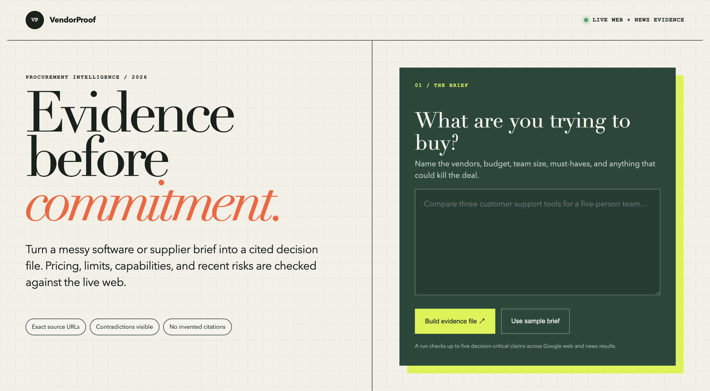
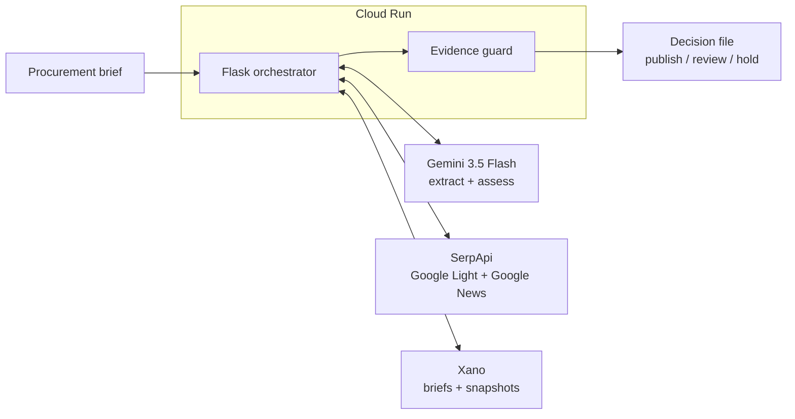

<p align="center"><b>English</b> | <a href="README_zh.md">简体中文</a></p>

<h1 align="center">VendorProof</h1>

<p align="center">
  <b>Make vendor decisions from live evidence, not stale spreadsheets.</b><br>
  Real-time web research · Exact citations · Risk signals · Refresh history
</p>

<p align="center">
  <a href="https://github.com/simonlin1212/vendorproof/actions/workflows/ci.yml"></a>
  
  
  
  
</p>

<p align="center">
  <a href="#the-problem">Problem</a> ·
  <a href="#how-it-works">How it works</a> ·
  <a href="#architecture">Architecture</a> ·
  <a href="#run-locally">Run locally</a> ·
  <a href="DEV_LOG.md">Development log</a>
</p>

---



VendorProof is an evidence-first AI procurement desk for small teams. Paste a
software or supplier brief and it checks the decision-critical claims against
current Google web and news results through SerpApi. Gemini classifies each
claim as supported, changed, conflicting, or insufficient, but it may cite only
the exact URLs returned in that live search. Xano stores the brief and evidence
snapshots so a later refresh can show what changed.

This standalone project targets the SerpApi and Xano cash tracks of the
[DevNetwork API + Cloud + AI Hackathon 2026](https://api-cloud-ai-hackathon-2026.devpost.com/).

## The problem

Vendor comparisons often live in spreadsheets that go stale as soon as prices,
limits, integrations, or reliability change. General AI answers make the
problem worse when they hide uncertainty or invent citations.

VendorProof turns that spreadsheet into a repeatable evidence file:

- live web and news research for each critical claim;
- exact, clickable source URLs;
- visible contradictions and incomplete searches;
- a conservative `publish`, `review`, or `hold` decision;
- persisted snapshots that make changes auditable.

## How it works

1. Gemini converts a bounded procurement brief into at most five verifiable
   claims with exact vendor and requirement anchors copied from the brief,
   official domains, fixed fact categories, and focused search queries.
   VendorProof rejects anchors absent from the input and derives persistent
   identity from deterministic entity and requirement atoms in the immutable
   brief; model-selected wording, domains, and categories cannot change it.
2. SerpApi runs Google Light and Google News searches for each claim.
   Domains written beside a vendor in the brief are bound to that vendor; when
   the brief omits one, a separate Google knowledge-panel lookup must confirm
   the model-selected domain. Same-name company domains are excluded from the
   evidence set.
3. Gemini evaluates only the returned evidence and produces a structured
   assessment.
4. A provenance guard removes citations that were not observed byte-for-byte in
   the current SerpApi response and downgrades unsupported conclusions.
5. Partial search failures remain visible and can never produce a silent
   all-clear.
6. Unmappable generated checks remain visible and force a review state.
7. Xano serializes writes per brief, compares stable claim keys, and saves the
   complete report as a new evidence snapshot.

## Architecture



Provider credentials stay server-side. The browser never receives the SerpApi
key, Xano token, or Google credentials. Gemini, SerpApi, and Xano are external
services; only the Flask orchestrator and evidence guard run inside Cloud Run.

## Safety and evidence guarantees

- Inputs are normalized and capped at 12,000 characters.
- Each run checks no more than five claims and twenty sources per claim.
- URLs keep the provider's exact bytes while rejecting malformed or
  control-containing values.
- Definitive verdicts without a current observed citation are downgraded.
- A failed evidence channel is displayed, never treated as “no risk.”
- Model output is validated with Pydantic before rendering or persistence.
- The live smoke test fails unless one complete claim has real search evidence.

## Run locally

Requirements: Python 3.12, `uv`, Google Vertex AI access, and a SerpApi key.
Xano is optional for local UI work but required for the Xano sponsor track.

```bash
uv sync --frozen
cp .env.example .env
# Fill the server-side values in .env, then authenticate Google locally.
gcloud auth application-default login
uv run gunicorn --bind :8080 --workers 1 --threads 8 --timeout 180 wsgi:app
```

Open `http://127.0.0.1:8080/`. Run the release checks with:

```bash
uv run ruff check .
uv run pytest --cov=vendorproof --cov-report=term-missing -q
uv run python scripts/live_smoke.py
```

The Xano schema and endpoint contract are documented in
[docs/XANO_BACKEND.md](docs/XANO_BACKEND.md). The current v5 XanoScript source is
included under [xano/](xano/) and is published on the live endpoint.

## Deployment

The repository includes a reproducible Python 3.12 container image. Production
deployment uses Cloud Run with secrets supplied as runtime environment values.
The public service is deployed, but the accepted configuration still needs a
zero-traffic candidate deployment, browser QA, and promotion before it becomes
the working demo. The Xano backend is already published and live-tested. The
promotion gate is recorded in
[docs/DEPLOYMENT.md](docs/DEPLOYMENT.md).

## Verification status

- 391 tests passing
- 95.26% branch-aware project coverage
- Ruff clean
- Google Vertex AI structured-output smoke passed with `gemini-3.5-flash`
- Xano v5 passed live acceptance, including stable refreshes, verdict changes,
  domain changes, and an empty-to-added report transition (snapshots 36–41)
- Complete Gemini + SerpApi + Xano live smoke passed and wrote Xano snapshot 42
- Final release-diff re-review and zero-traffic Cloud Run candidate QA remain

See [DEV_LOG.md](DEV_LOG.md) for dated evidence and [NEXT.md](NEXT.md) for the
current release gate.

## License

MIT. See [LICENSE](LICENSE).

**Author:** Simon Lin · X [@linsizhen](https://x.com/linsizhen) · Email: [simonlin0423@gmail.com](mailto:simonlin0423@gmail.com)

## Support

If this project saves a procurement team from one stale spreadsheet, coffee is
welcome.

<p align="center">
  <a href="https://buymeacoffee.com/simonlin1212"></a>
</p>
